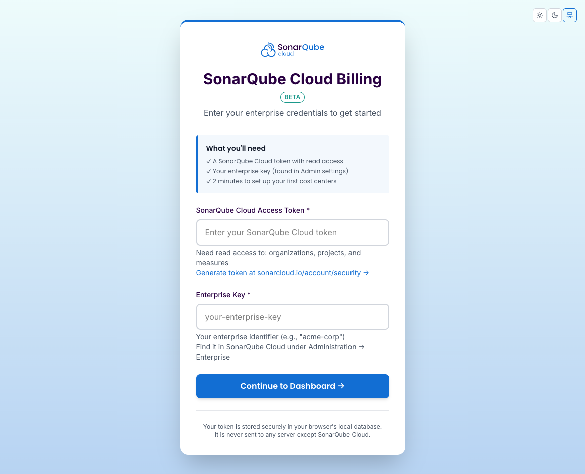

# Quick Start Guide

## Installation & Setup

### 1. Install Dependencies
```bash
npm install
```

### 2. Build the Application
```bash
npm run build
```

### 3. Start the Server
```bash
npm run server
# or
npm start  # (builds and starts in one command)
```

The application will:
- Start on `http://localhost:3000`
- Automatically open your browser
- Show the welcome screen



Enter your SonarQube Cloud token on the welcome screen (get one from SonarQube Cloud → My Account → Security → Generate Token). The app stores it in the browser and does not need a `.env` file.

**Optional:** If you run the test scripts from the command line (`node test-api.js` or `node test-e2e.js`), create a `.env` from `.env.example` and set `SONAR_TOKEN` so you don't have to pass the token as an argument. Never commit `.env`; it's in `.gitignore`.

## Testing the API

### Run API Tests
```bash
node test-api.js
```

This will:
- Test all 7 SonarQube Cloud API endpoints
- Show detailed results with color-coded output
- Verify your token is working correctly

### Expected Output
```
╔════════════════════════════════════════════════════════╗
║   SonarQube Cloud API Endpoint Tests                       ║
╚════════════════════════════════════════════════════════╝

✓ Passed:  7/7
Success Rate: 100.0%

🎉 All tests passed!
```

## Available Scripts

| Script | Command | Description |
|--------|---------|-------------|
| Development | `npm run dev` | Start Vite dev server with HMR |
| Build | `npm run build` | Build TypeScript and bundle for production |
| Server | `npm run server` | Start the Express server (production) |
| Start | `npm start` | Build and start (one command) |
| Lint | `npm run lint` | Run ESLint |
| Preview | `npm run preview` | Preview production build locally |
| Package | `npm run package` | Create standalone binaries |

## Features

### Dashboard
- View billing data for all projects
- Filter by organization, tags, and date ranges
- Export data to Excel
- View cost breakdowns and trends

### API Integration
The application connects to SonarQube Cloud through a built-in proxy server:
- **Frontend**: `http://localhost:3000`
- **Proxy**: `/api/*` → https://sonarcloud.io/api/*; `/billing`, `/organizations`, `/enterprises` → https://api.sonarcloud.io. See `server.js` for full mapping.
- **Token**: Passed via Bearer authentication

### Data Endpoints
1. Organizations - List all organizations you're a member of
2. Projects - Search and filter projects
3. Project Tags - Get all available tags
4. Measures - Get metrics (LOC, coverage, bugs, etc.)
5. History - Get historical metric data
6. Component Tree - Get file-level details

## Troubleshooting

### Port Already in Use
```bash
# Change the port
PORT=3001 npm run server
```

### Browser Doesn't Open
```bash
# Disable auto-open
NO_OPEN=true npm run server
# Then manually visit: http://localhost:3000
```

### API Errors
1. Check your token is valid
2. Run the test script: `node test-api.js`
3. Check the console for detailed error messages

### Build Errors
```bash
# Clean install
rm -rf node_modules package-lock.json
npm install
npm run build
```

## Development

### Project Structure
```
├── src/
│   ├── components/      # React components
│   ├── services/        # API services
│   ├── hooks/           # React hooks
│   ├── types/           # TypeScript types
│   └── utils/           # Utility functions
├── server.js            # Express server
├── test-api.js          # API test script
└── dist/                # Production build
```

### Making Changes
1. Edit source files in `src/`
2. Run `npm run dev` for development with HMR
3. Build with `npm run build` for production
4. Test with `npm run server`

## Support

For issues or questions:
1. See [README.md](./README.md) (Troubleshooting) and [API_LIMITS.md](./API_LIMITS.md)
2. Run `node test-api.js` to verify API connectivity
3. Check browser console for detailed errors
4. Review server logs for proxy errors
5. Development guidelines: [CLAUDE.md](./CLAUDE.md)
