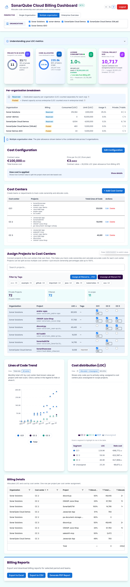

# SonarQube Cloud Billing Report

A self-contained web application for visualizing SonarQube Cloud metrics focused on billing and cost allocation.



## ✨ Features

- **No Configuration Required**: Enter your SonarQube Cloud token in the UI - no `.env` files needed
- **Comprehensive Billing Dashboard**: View costs, trends, and breakdowns by organization, project, and tags
- **Cost Center Management**: Create teams/departments, assign projects, track code ownership, and allocate costs
- **Multiple Perspectives**: Single organisation, multiple organisation comparison, or enterprise-wide overview
- **Smart Selection**: Build comparison sets with visual selection state management
- **Multiple Deployment Options**: Run as Node.js app or standalone executable; deploy to Netlify, Vercel, or other static hosts
- **Built-in API Proxy**: Handles SonarQube Cloud API authentication and CORS
- **Data Export**: Export reports to Excel, CSV, or PDF
- **Real-time Metrics**: Track lines of code, quality metrics, and historical trends

## 🚀 Quick Start

```bash
# Clone repository
git clone git@github.com:pstember/sonar-billing-report.git
cd sonar-billing-report

# Install dependencies
npm install

# Build and start
npm start
```

Visit `http://localhost:3000` and enter your SonarQube Cloud token to get started.

## 📚 Documentation

| Document | Description |
|----------|-------------|
| [QUICK_START.md](./QUICK_START.md) | Getting started, features, troubleshooting |
| [BUILD.md](./BUILD.md) | **Build, package, and create executables** |
| [DEPLOYMENT.md](./DEPLOYMENT.md) | Deploy options (cloud, local proxy) |
| [SECURITY.md](./SECURITY.md) | Security best practices |
| [API_LIMITS.md](./API_LIMITS.md) | SonarQube Cloud API constraints |
| [CLAUDE.md](./CLAUDE.md) | Development guidelines |
| [CHANGELOG.md](./CHANGELOG.md) | Recent changes |

## 🏗️ Building & Packaging

### Run in Development
```bash
npm run dev
```

### Build for Production
```bash
npm run build
npm run server
```

### Create Standalone Executables
```bash
npm run package
```

This creates platform-specific executables (macOS, Linux, Windows) in the `./binaries/` folder. **See [BUILD.md](./BUILD.md) for complete instructions.**

## 🚀 Deployment

Multiple deployment options:

1. **Standalone Executable** - Single file, no dependencies (see [BUILD.md](./BUILD.md))
2. **Node.js Server** - Standard Node.js deployment
3. **Cloud Platforms** - Deploy to Netlify, Vercel, etc.

## 🔒 Security

- Tokens are stored in browser localStorage only
- No tokens stored on server or in logs
- API proxy handles authentication
- See [SECURITY.md](./SECURITY.md) for details

## 🧪 Testing

```bash
# Test API endpoints
node test-api.js

# End-to-end tests
node test-e2e.js

# Build and verify
npm run build
```

## 📖 For Contributors

See [CONTRIBUTING.md](./CONTRIBUTING.md) for contribution guidelines and [CLAUDE.md](./CLAUDE.md) for development guidelines.

## 📄 License

See [LICENSE](./LICENSE) file for details.

---

For issues or questions, see [QUICK_START.md](./QUICK_START.md) troubleshooting section.
